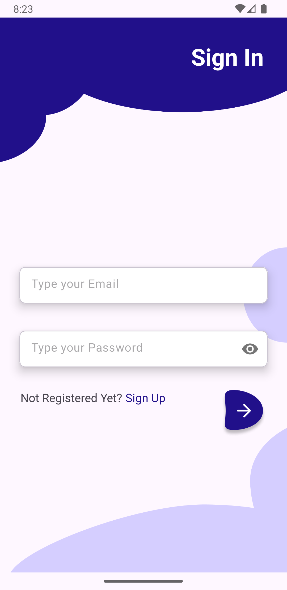
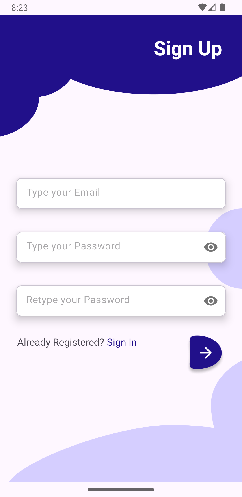
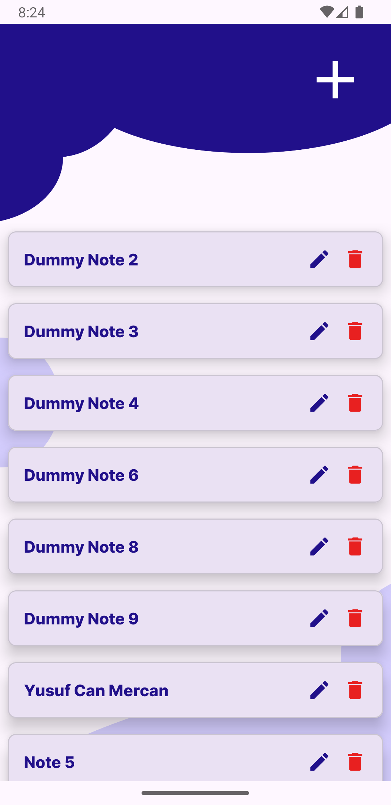
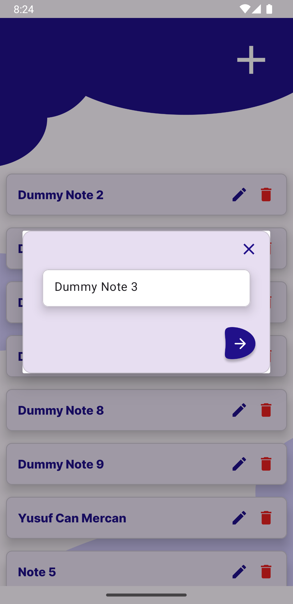

# ToDoFirebase

+ Kotlin öğrenirken yaptığım bir başka uygulamamı paylaşmak istedim. ToDoFirebase, basit bir todo not tutma uygulamasıdır. Önceki yaptığım not tutma uygulamasından farklı olarak verileri yerelde değil, Firebase veritabanında tutmaktadır. Kullanıcı, içeriğini girip Firebase veritabanına kaydettiği yapılacaklar listesini istediği zaman görüntüleyebilir ve silebilir.

## Temel Özellikler:

+ İçeriği girilen bir todo Firebase veritabanında kayıt altına alınabilir.
+ Oluşturulan todo'lar ana ekranda görüntülenebilir.
+ İstenilen todo uygulama silinse dahi geri yüklemede e-posta ve şifre ile giriş yapıldığı sürece görülebilir.
+ İstenilmeyen todo silinebilir.

## Kurulum:

    git clone https://github.com/cusufcan/to_do_firebase

## Ekran Görüntüleri:

<table>
    <tr>
        <td></td>
        <td></td>
        <td></td>
    </tr>
    <tr>
        <td></td>
        <td></td>
        <td></td>
    </tr>
</table>

## Kullanılan Teknolojiler:

+ Kotlin
+ ViewBinding
+ Runnable / Handler
+ Firebase Auth
+ Firebase Realtime Database
+ Navigation

## Lisans:

    MIT

